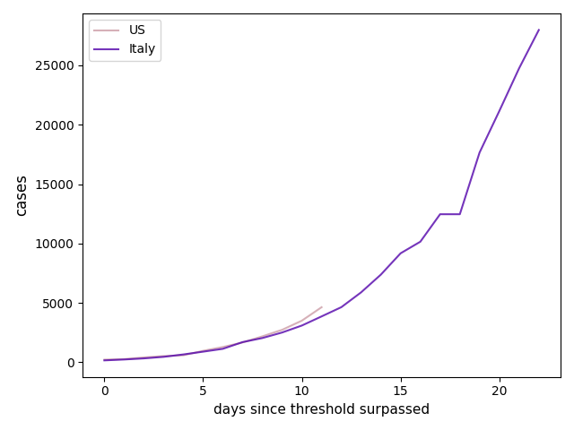

# COVID-19

This is a python script I wrote which can compare the curve of confirmed cases or deaths due to COVID-19 between various countries. For instance, here is a comparison between the US and Italy, as of March 16, 2020.



To run it, simply open a terminal and type:

```python3 covid.py```

You will be greeted by some ASCII art and a question which reads:

```Would you like to graph confirmed cases or deaths (enter 'cases' or 'deaths'):```

Entering either `cases` or `deaths` will prompt the script to download the latest data from the Johns Hopkins server. This could take a few minutes depending on your internet connection. Then, you will be prompted to enter the minimum number of cases per country to start comparing cases. You can think of this like 'day zero,' where once a country hits, say, 150 cases, that is considered the day zero of the curve. 

```Enter a minimum incidence threshold for day 0 (some integer greater than zero):```

Then the script will display a list of country names. You can enter any number of country names, but the spelling and punctuation must match exactly. Sorry.

```Enter the countries you wish to compare from the list above, separated by spaces:```

After entering the countries you wish to compare and pressing enter, you will see a graph comparing them.
